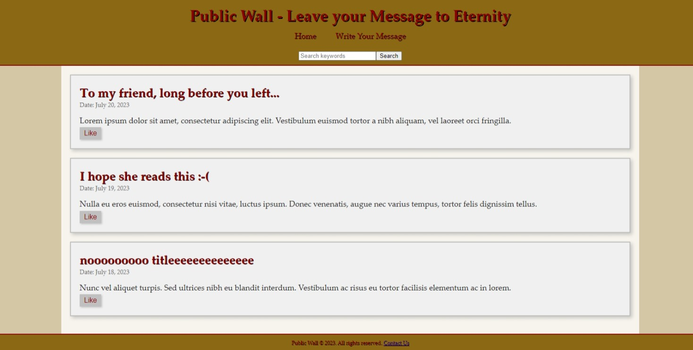

# Public Wall

Public Wall is ancient-themed website that allows people to write anonymous message and leave it for eternity.

## gallery

## running

1. Clone the repository
2. In the root directory, run `python manage.py runserver`